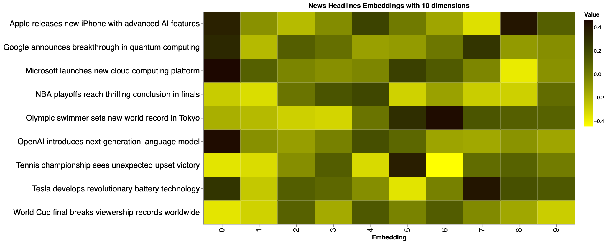
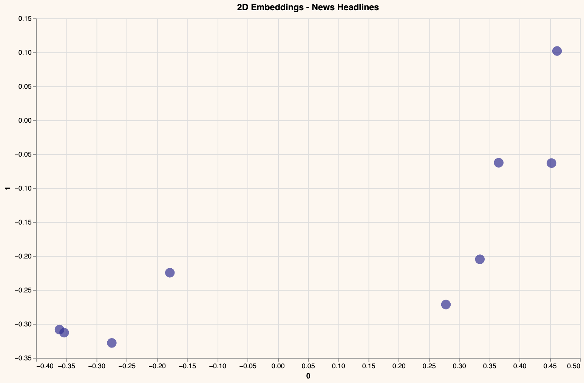
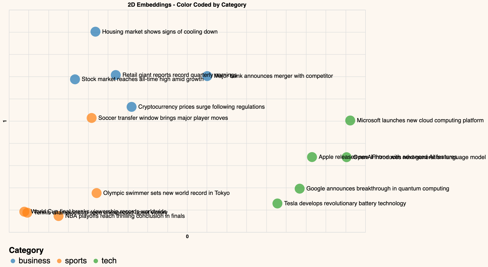

# 📊 Why Text Embeddings Matter for Data Analysts
### Text embeddings convert human language into numerical vectors, enabling data analysts to:

- 🔍 Discover Hidden Patterns - Find similar content across large text datasets
- 📈 Quantify Text Similarity - Measure semantic relationships mathematically
- 🎯 Automate Content Categorization - Group similar documents without manual labeling
- ⚡ Scale Text Analysis - Process thousands of documents efficiently
- 🎨 Visualize Text Relationships - Create compelling charts from unstructured data

This skill helps data analysts quickly understand and organize large volumes of text data by converting it into a quantifiable format, enabling automated categorization, improved search, and the identification of trends and anomalies.

### 🎯 Real-World Applications for Data Analysts

#### 1. Customer Feedback Analysis:
Group customer reviews by sentiment and topic
- embeddings = get_embeddings(customer_reviews)
- clusters = perform_clustering(embeddings, n_clusters=5)
Automatic categorization of feedback themes
#### 2. Content Recommendation Systems
Find articles similar to user preferences
- similar_content = find_similar_headlines(user_query, article_embeddings)
Personalized content suggestions
#### 3. Market Research & Trend Analysis
Identify emerging topics in news/social media
- topic_clusters = visualize_embeddings(news_headlines)
Visual map of trending themes
#### 4. Document Organization
Automatically organize research papers, reports, emails
- document_similarity = cosine_similarity(document_embeddings)

### Core Skills

- ✅ Convert text to numerical embeddings using Cohere API
- ✅ Reduce high-dimensional data with PCA
- ✅ Create interactive visualizations with Altair
- ✅ Measure text similarity with cosine similarity
- ✅ Perform unsupervised clustering on text data

### Advanced Techniques

- 🔧 Dimensionality reduction for visualization
- 🔧 K-means clustering for topic discovery
- 🔧 Semantic search implementation
- 🔧 Interactive dashboard creation

### Key Vizuals 

This heatmap shows the numerical values of the first 10 principal components for several news headlines. Each row represents a headline, and each column represents one of the 10 reduced embedding dimensions. The color intensity (from yellow to black) indicates the value of the embedding in that specific dimension, allowing for a visual comparison of how different headlines vary across these components. Similar colors across a column for different headlines suggest similar values in that embedding dimension.

This scatter plot represents news headlines in a two-dimensional space. Each point corresponds to a headline, and its position is determined by its first two principal components. Headlines that are semantically similar are positioned closer to each other in this plot.

This is an enhanced version of the 2D scatter plot, where each point (headline) is colored according to its category (business, sports, or tech). This visualization clearly shows clusters of headlines belonging to the same category, demonstrating that the embedding process effectively groups semantically similar news articles together. For example, tech headlines should cluster together, as should sports headlines and business headlines.

